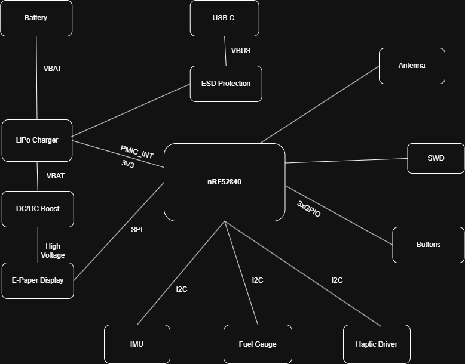

# Proiect-InkTime
Design for a minimalist smartwatch optimized for month-class battery life and sunlight readability.

## Block Diagram

## Bill of Materials

| Component / Module | Qty | Purchase Link (JLC Parts) | Datasheet |
| :--- | :---: | :--- | :--- |
| **nRF52840 SoC** (Bluetooth MCU) | 1 | [JLC C190794](https://jlcpcb.com/partdetail/C190794) | [Download](https://files.seeedstudio.com/wiki/XIAO-BLE/Nano_BLE_MCU-nRF52840_PS_v1.1.pdf) |
| **BQ25180YBGR** (LiPo Charger) | 1 | [LCSC BQ25180](https://www.lcsc.com/search?q=BQ25180) | [Download](https://www.ti.com/lit/ds/symlink/bq25180.pdf) |
| **MAX17048G+T10** (Fuel Gauge) | 1 | [JLC C2682616](https://jlcpcb.com/partdetail/MaximIntegrated-MAX17048GT10/C2682616) | [Download](https://datasheets.maximintegrated.com/en/ds/MAX17048-MAX17049.pdf) |
| **RT6160AWSC** (Buck-Boost) | 1 | [JLC C7065276](https://jlcpcb.com/partdetail/C7065276) | [Download](https://www.richtek.com/assets/product_file/RT6160A/DS6160A-02.pdf) |
| **BMA423** (Accelerometer/IMU) | 1 | [Mouser BMA423](https://www.mouser.ro/ProductDetail/Bosch-Sensortec/BMA423) | [Download](https://www.bosch-sensortec.com/media/boschsensortec/downloads/datasheets/bst-bma423-ds000.pdf) |
| **DRV2605YZFR** (Haptic Driver) | 1 | [JLC C81079](https://jlcpcb.com/partdetail/C81079) | [Download](https://www.ti.com/lit/ds/symlink/drv2605.pdf) |
| **USBLC6-2SC6** (ESD Protection) | 1 | [JLC C2827654](https://jlcpcb.com/partdetail/TECHPUBLIC-USBLC62SC6/C2827654) | [Download](https://www.st.com/resource/en/datasheet/usblc6-2.pdf) |
| **KH-TYPE-C-16P** (USB-C Connector) | 1 | [JLC C709357](https://jlcpcb.com/partdetail/KH-TYPE-C-16P/C709357) | [Download](https://datasheet.lcsc.com/lcsc/2112221830_Shenzhen-Kinghelm-Elec-KH-TYPE-C-16P_C709357.pdf) |
| **FTC252012SR47MB** (0.47uH Inductor) | 1 | [JLC C5832368](https://jlcpcb.com/partdetail/6763488-FTC252012SR47MBCA/C5832368) | [Download](https://product.tdk.com/system/files/dam/doc/product/inductor/inductor/smd/catalog/inductor_commercial_power_mlp2016_en.pdf) |
| **2450AT18B100E** (Chip Antenna) | 1 | [JLC C11022](https://jlcpcb.com/partdetail/Johanson-Technology-2450AT18B100E/C11022) | [Download](https://www.johansontechnology.com/datasheets/2450AT18B100.pdf) |
| **EVP-AKE31A** (Tactile Buttons) | 3 | [Panasonic EVP-AKE31A](https://www.mouser.ro/ProductDetail/Panasonic/EVP-AKE31A) | [Download](https://industrial.panasonic.com/cdbs/www-data/pdf/ATV0000/ATV0000CE28.pdf) |
| **503480-2400** (E-Paper Connector) | 1 | [Molex 503480-2400](https://www.mouser.ro/ProductDetail/Molex/503480-2400) | [Download](https://www.molex.com/pdm_docs/sd/5034802400_sd.pdf) |
| **MBR0530** (Schottky Diode) | 3 | [JLC C475718](https://jlcpcb.com/partdetail/C475718) | [Download](https://www.onsemi.com/pdf/datasheet/mbr0530t1-d.pdf) |

## Hardware Functionality Overview
* Core MCU: Powered by the nRF52840 SoC, an ARM Cortex-M4F processor supporting Bluetooth LE and ultra-low power operation.
* Display Interface: Features an E-Paper Display connected via a 24-pin FPC connector (503480-2400). It uses a specialized E-Paper Drive Circuit for high-voltage pulse generation.
* Motion Sensing: Includes a BMA421 3-axis accelerometer (IMU) for step counting and gesture detection, connected via I2C.
* Tactile Feedback: Integrated DRV2605YZFR haptic driver to provide vibration alerts and tactile user interaction.
* Power Management:
  * LiPo Charging: Managed by the BQ25180YBGR IC for safe battery charging via USB-C.
Battery Gauging: Uses the MAX17048G+T10 fuel gauge to accurately monitor battery state-of-charge.

  * Voltage Regulation: An RT6160AWSC DC/DC buck-boost converter provides a stable 3.3V system rail from the fluctuating battery voltage.
* User Interface: Three tactile buttons for navigation: SW_UP, SW_ENT, and SW_DN.
* Communication & Debug:
   * Antenna: 2.4GHz ceramic chip antenna (2450AT18B100E) for Bluetooth connectivity.
   * SWD Interface: TC2030-IDC connector for programming and debugging the nRF52840.

## nRF52840 Detailed Pin Mapping
The pins are assigned to optimize low-power peripheral management and shared communication buses:

* I2C Bus (Shared):
P0.26 (SDA) & P0.27 (SCL): Shared bus for the IMU (BMA421), Fuel Gauge (MAX17048), Haptic Driver (DRV2605), and LiPo Charger (BQ25180).

* Navigation Buttons:
P1.04: Assigned to SW_UP.
P1.02: Assigned to SW_ENT.
P1.06: Assigned to SW_DN.

* E-Paper Display Control:
SPI Interface: Dedicated pins for MOSI, SCK, and CS for fast display updates.
P0.11 / P0.12: Control lines for display Reset, Busy, and Data/Command (D/C) selection.

* Power Control:
P0.14: Used as an enable signal (TIC_EN) for peripheral power management.

* Debug/Programming:
SWDIO / SWCLK: Dedicated hardware pins for Serial Wire Debug.

